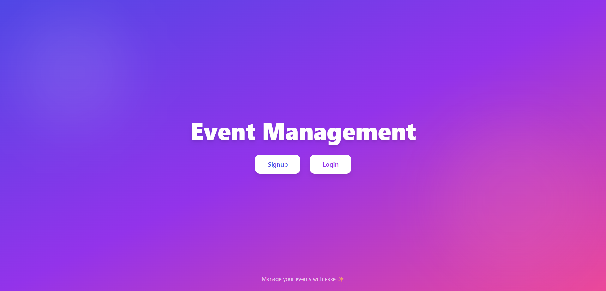
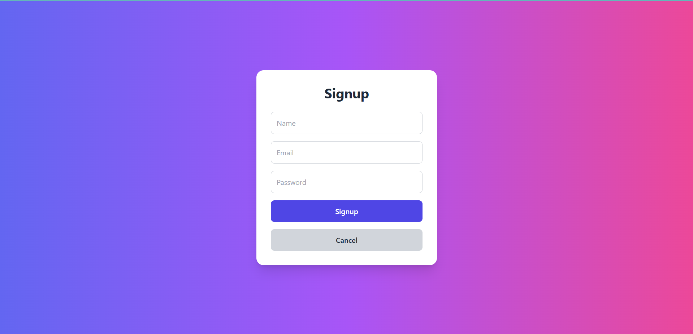
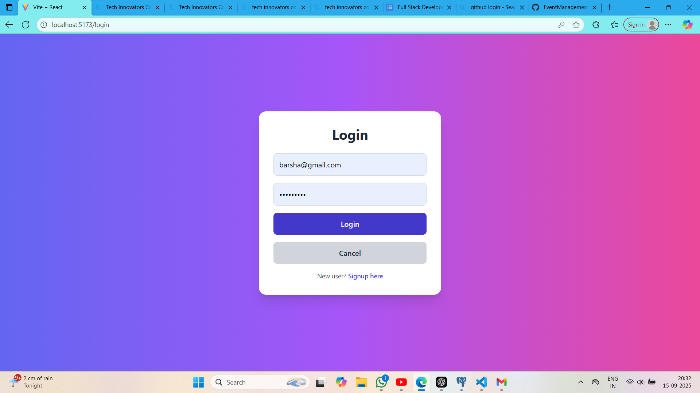
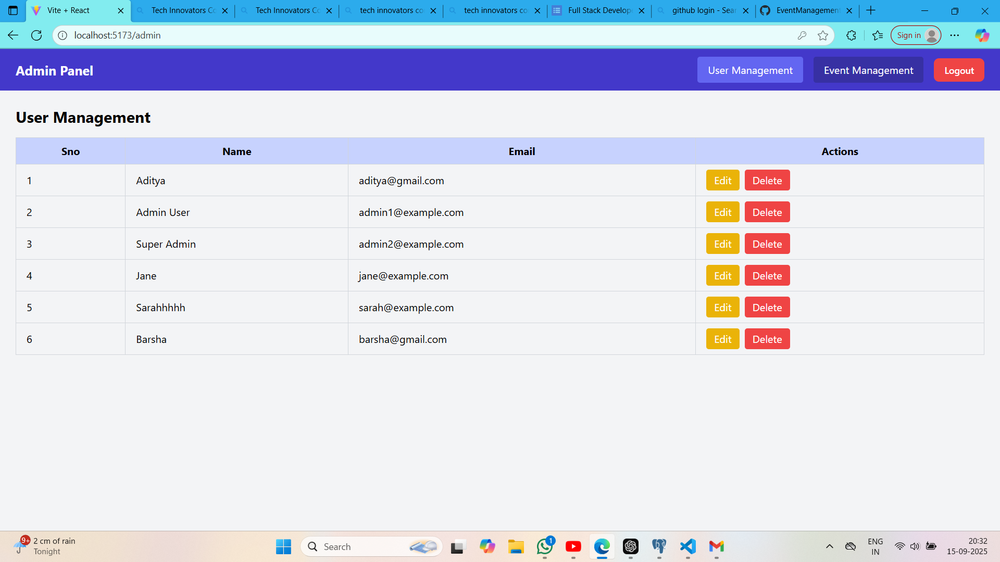
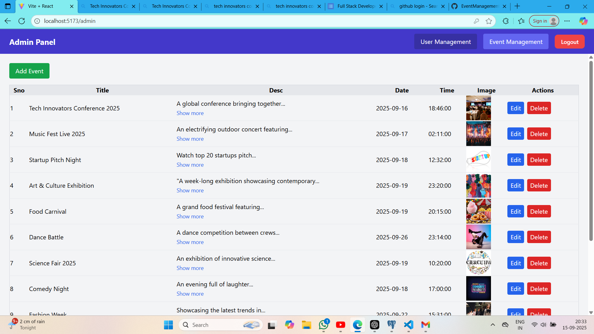
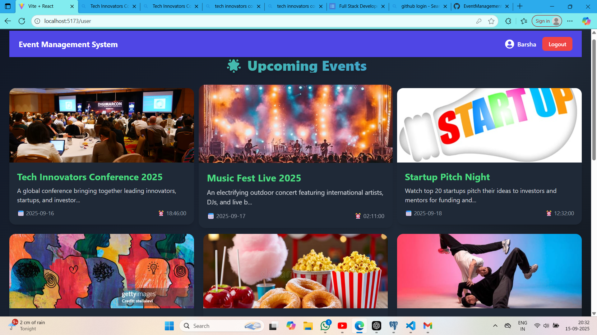

# 🎉 Event Management System

A **full-stack Event Management web application** built with **React, Tailwind CSS, FastAPI, and PostgreSQL**.  
Admins can **add, edit, and delete events with images**, while users can **browse events in a beautiful UI**.

---

## ✨ Features

- 🔑 User authentication (signup & login with roles)
- 📅 Admin: Add, edit, delete events with images
- 👥 User: View all events in a clean, responsive UI
- 📷 Image upload support
- ⚡ Modern UI with Tailwind CSS
- 🗄️ FastAPI backend with PostgreSQL database

---

## 📸 Screenshots

### 🏠 Home Page

### 🔑 Signup Page

### 🔑 Login Page

### 📅 User Management (Admin Panel)

### 📅 Event Management (Admin Panel)

### 👥 User Panel (Event View)

---

## 🛠️ Tech Stack

**Frontend:** React, Tailwind CSS, Axios, React Router  
**Backend:** FastAPI, Python  
**Database:** PostgreSQL  
**Hosting:** (Optional: mention if you deploy on Render/Heroku/Vercel)

---
